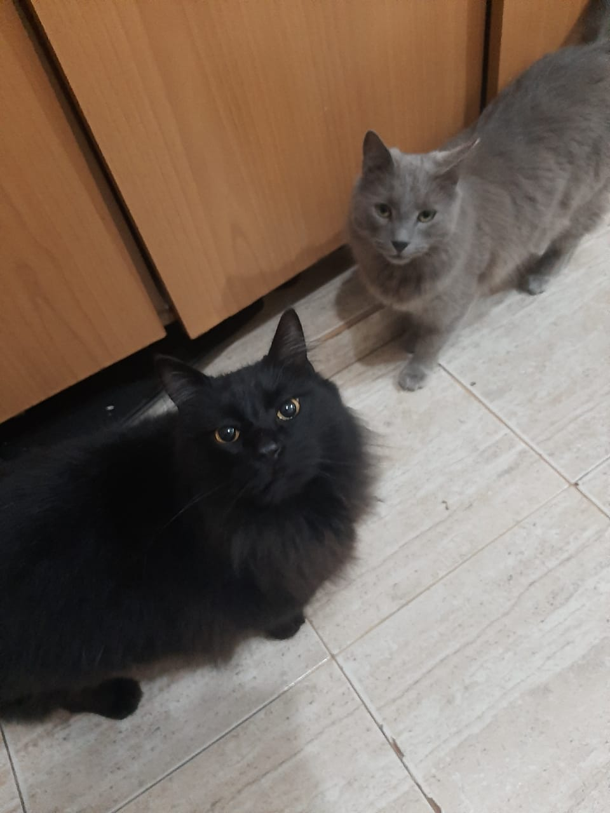

# Programación con objetos I
## Presentación Personal
- Mi nombre es: Julieta Ruiz, vivo en Merlo (Zona Oeste). Estoy estuidando la carrera en Tecnicatura en Programacion. En mis tiempos libres juego deportes como voley o entreno. Tengo 5 mascotas, perros y gatos. Trabajo con mi emprendimiento gastronomico y tambien trabajo de cuidadora de personas mayones en Caballito. Gran parte del tiempo estoy viajando y trato de matar el tiempo viendo pelicas o escuchando musica. Este es mi primer contacto con github de forma mas formal ya que inicialice algunos pasos con cursos de Python dados por la Universidad pero solia dejarlo de lado por tiempos y ect. 
Les comparto una foto de mis mascotas. 
